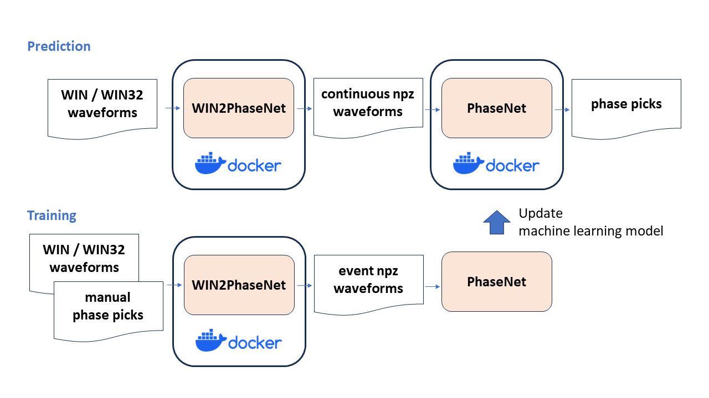

# WIN2PhaseNet
## Summary


 
* Tool to make data for prediction and training of PhaseNet (Zhu and Beroza, 2019) from WIN/WIN32 (hereafter just 'WIN') format waveform file and pick list.
* High-speed processing is possible through the use of fwin module (Maeda, 2019) written in **fortran** and **multi-thread processing**.
* Easy to run on various OS by using **docker**.
* Provides the simplified operating procedure for PhaseNet and a docker environment to run PhaseNet.

## Requirements
* OS <br>
  Support Windows, macOS and Linux

* (Only required for Windows) Git Bash <br>
  https://gitforwindows.org/ <br>
  For Windows, run "Git Bash" and use it to execute commands for following steps.

* docker <br>
  * Installation <br>
  For Windows and macOS, install "Docker Desktop" and run it to activate docker. <br>
  https://docs.docker.com/get-docker/ <br>
  For Linux, install "Docker Engine". <br>
  https://docs.docker.com/engine/install/ <br>

  * (Only required for Linux) Create the docker group and add your user <br>
  https://docs.docker.com/engine/install/linux-postinstall/#manage-docker-as-a-non-root-user <br>

  * Verify installation <br>
    ```
    $ docker run hello-world
    ...
    Hello from Docker!
    This message shows that your installation appears to be working correctly.
    ...
    ```

## Usage
* Installation
  ```
  $ git clone https://github.com/rintr-suzuki/WIN2PhaseNet.git
  $ cd WIN2PhaseNet
  ```

* Execution
  ### WIN2PhaseNet
  ```
  $ ./WIN2PhaseNet.bash -m cont --tbl2lst
  # See 'out' directory for the result.
  ```

  ### PhaseNet prediction
  ```
  $ ./PhaseNet.bash --model_dir=src/PhaseNet/model/190703-214543 --data_dir=out/npz --data_list=out/npz.csv --amplitude --plot_figure
  # See 'results' directory for the result.
  ```

* See following documents for the detailed information. <br>
  For PhaseNet prediction, see [here](docs/README-prediction.md). <br>
  For PhaseNet training, see [here](docs/README-training.md). <br>

* See [here](docs/Tips.md) for the tips of this tool.

## Acknowledgements
A part of this program was created by Uchida, N and Matsuzawa, T.

## References
* Maeda, T (2019), Development of a WIN/WIN32 format seismic waveform data reader. The 2019 SSJ Fall Meeting. (In Japanese)
* Saito, M (1978), An automatic design algorithm for band selective recursive digital filters, Geophysical exploration, 31, 240-263. (In Japanese)
* Takagi, R., Uchida, N., Nakayama, T., Azuma, R., Ishigami, A., Okada, T., Nakamura, T., & Shiomi, K. (2019), Estimation of the orientations of the S-net cabled ocean-bottom sensors. Seismological Research Letters, 90(6), 2175–2187. https://doi.org/10.1785/0220190093
* Zhu, W., & Beroza, G. C. (2019), PhaseNet: A deep-neural-network-based seismic arrival-time picking method. Geophysical Journal International, 216(1), 261–273. https://doi.org/10.1093/gji/ggy423